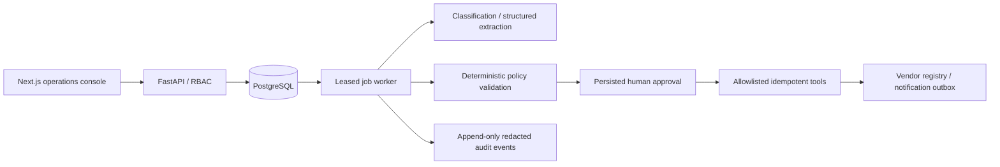

# FlowPilot architecture

## Intent and scope

Build a portfolio system that turns vendor onboarding requests into auditable,
human-approved work. The supplied PRD is the acceptance authority, including at
least 100 automated scenarios, extraction benchmarks, screenshots and a demo GIF.
Invoice review and contract requests are classified but escalated, not executed.

## Selected design

Independent modular monolith: Next.js → FastAPI → PostgreSQL; a separate durable
worker runs an explicit state machine. A custom state machine makes every transition
visible and testable. LangGraph is optional in the PRD; a general DAG builder and
microservices would add complexity without improving the vendor onboarding use case.

## State and authority

RECEIVED → CLASSIFYING → EXTRACTING → VALIDATING → PENDING_APPROVAL → EXECUTING →
COMPLETED is the successful path. Missing fields move to NEEDS_INFORMATION; unsupported
request types, low confidence and exhausted transient failures move to
NEEDS_MANUAL_REVIEW. Only explicit authorized decisions can reject or approve.
Changes produce a new revision and invalidate previous approval. A requester cannot
approve their own request, including when they also hold admin privileges.

Roles are requester, reviewer, approver and admin. Requesters see their own workflows;
reviewers inspect workflows and request changes; approvers make approval decisions;
admins manage users and recovery. The API derives actor/role from a verified session,
never from client-supplied actor or role headers. Sensitive side effects verify an
approval for the exact validated revision immediately before execution.

## Modules and schema

- `config`, `db`, `models`: settings, transactions and schema.
- `security`: password/session hashing, Fernet encryption, keyed tax-ID fingerprints,
  recursive redaction; encrypted tax IDs are never returned by normal API serializers.
- `domain`: explicit transitions, vendor schema, evidence and policy validation.
- `providers`: strict structured extraction and classification with timeouts.
- `orchestration`: step execution, revision checks, retry/escalation and resume.
- `tools`: extract_document, validate_vendor, check_duplicate_vendor, create_vendor,
  send_notification. No arbitrary tools or code execution.
- `audit`: event sequence and hash chain; PostgreSQL triggers deny update/delete.
- `api`: bounded uploads, authenticated commands and read models.

Users have roles and hashed passwords; opaque sessions are hashed and expire.
Workflows own documents, extraction revisions, validation snapshots, approval records,
job records and audit events. Tool executions have globally unique idempotency keys
and payload hashes. Vendor registry has a unique keyed tax-ID fingerprint.
Notifications are persisted in a transactional outbox and visible in the product;
external webhooks are optional, use explicit endpoints and preserve idempotency keys.
No claimed email delivery without an actual configured delivery transport.

## Reliability invariants

1. Invalid transitions cannot mutate state or emit successful transition events.
2. No sensitive side effect before authorized approval of the current revision.
3. Approval of one revision cannot authorize another revision.
4. Reused idempotency keys with different payloads return a conflict.
5. Retries only apply to retry-safe transport failures, use bounded exponential
   backoff and persist next-run timestamps. Exhaustion escalates visibly.
6. Vendor creation, tool receipt and audit event commit in the same transaction.
7. Every decision and tool attempt has a correlated redacted audit event. Payloads
   are allowlisted; raw request text and tax/bank values are not copied into logs.
8. Leases and row locks prevent two workers from concurrently committing a step.
9. Document presence comes from uploaded, classified evidence, not an unchecked
   boolean in a request or a model's unsupported assertion.
10. Validation is deterministic: required fields, tax/email formats, expiry and
    source evidence, low confidence and duplicates all have explicit outcomes.

## Verification and delivery

Unit tests exercise state/role/policy matrices and redaction. PostgreSQL integration
tests prove uniqueness, rollback, append-only events and concurrent claims/approvals.
HTTP tests prove role enforcement and object ownership. At least 100 meaningful
scenarios cover valid, missing, malformed, low-confidence, rejected, revised, expired,
duplicate, retried and unauthorized requests. Report classification and extraction
accuracy separately from orchestration reliability; synthetic fixtures are labeled.
Docker Compose, migrations, CI, deployment runbook and browser tests accompany the
UI. README includes measured benchmarks, diagrams, screenshots and demo GIF.
